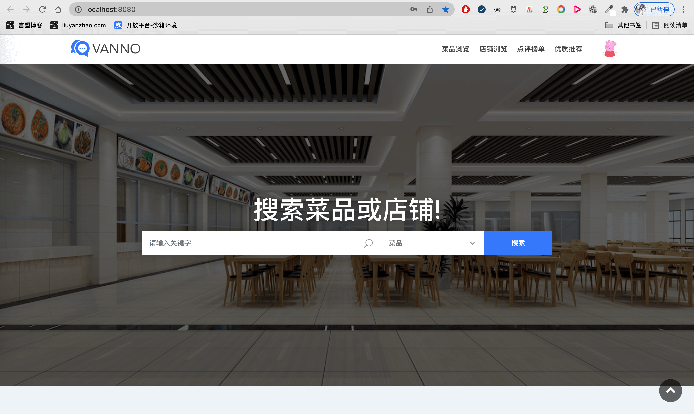
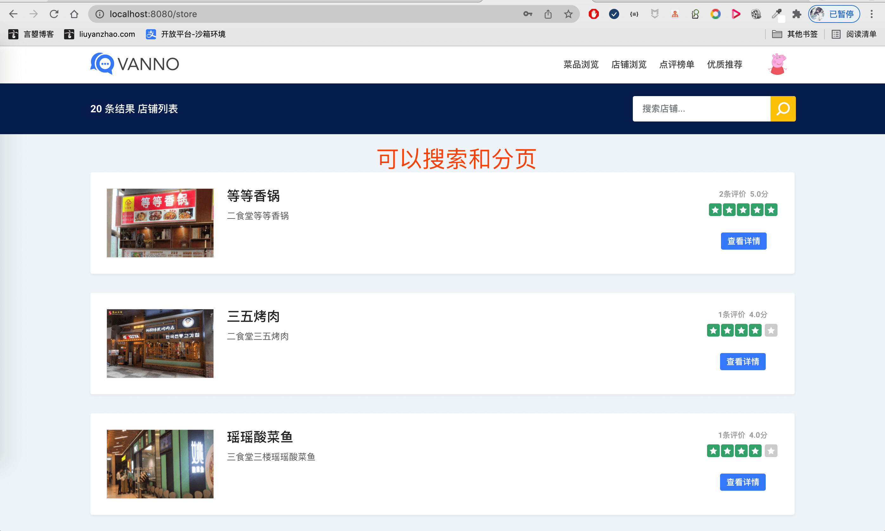
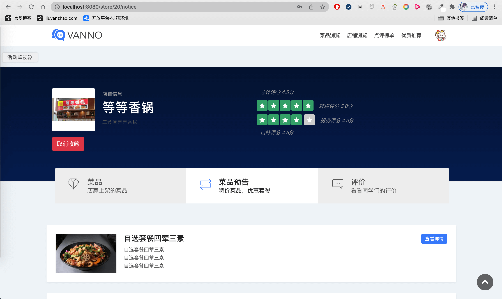
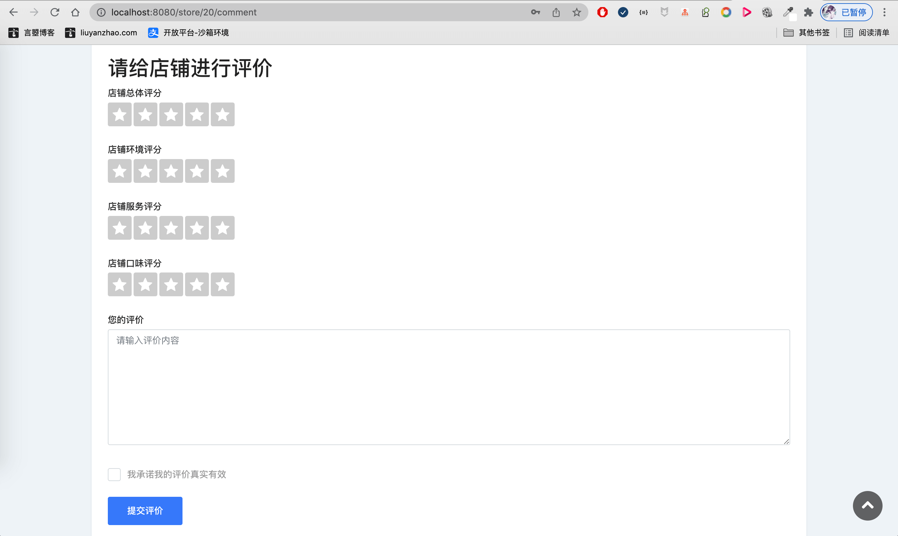
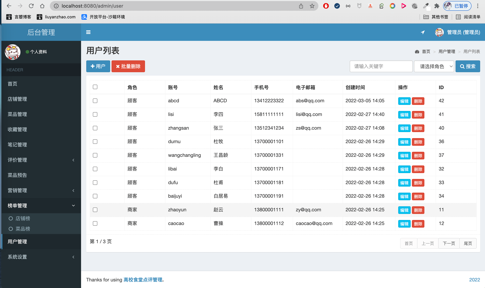
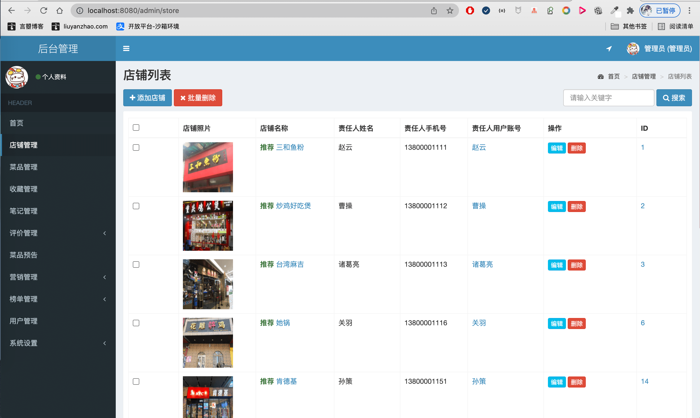
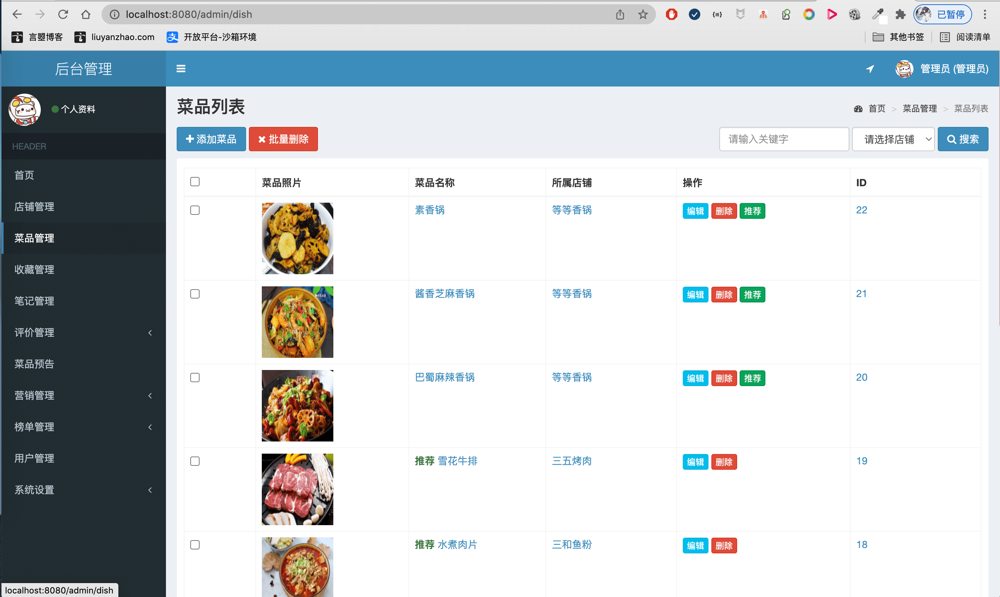
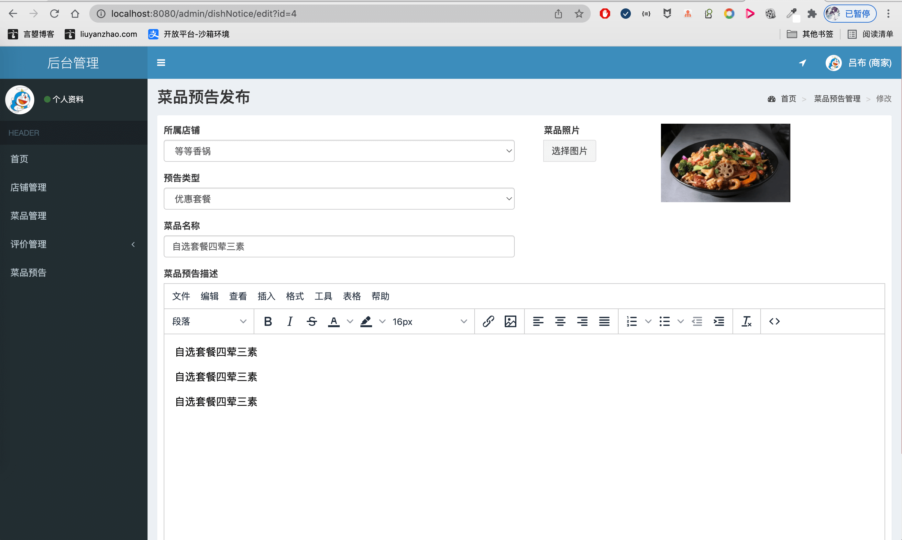
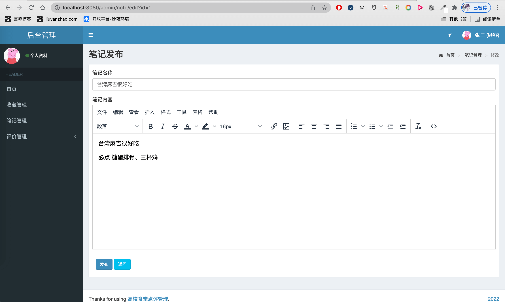

- 基于SpringBoot的高校食堂点评系统 大众点评系统
- 预览地址：[http://dianping.liuyanzhao.com](http://dianping.liuyanzhao.com) 已部署
- 详细介绍地址：[https://liuyanzhao.com/shop/dianping.html](https://liuyanzhao.com/shop/dianping.html)
- 代码地址：https://github.com/saysky/dianping 或 https://gitee.com/saysky/dianping
- 该项目有1小时的代码讲解视频 2023

# 一、功能介绍
## 用户
- 菜品浏览、店铺浏览
- 商铺评价、菜品评价
- 收藏店铺、收藏菜品、我的收藏
- 点评榜单：最受欢迎的店铺、菜品排行、环境服务排行、新品推荐排行
- 做笔记

## 商户
- 商铺信息编辑
- 评价管理
- 菜品信息管理
- 菜品预告：特价菜品、优惠套餐

## 管理员
- 商铺管理
- 用户管理
- 审核管理 
- 营销管理
    推荐菜品
    优质窗口
- 榜单管理：商家榜 菜品榜
    - 好评榜：总排名
    - 热门榜：浏览量
    - 口味榜：口味评分排名
    - 环境榜：环境评分排名
    - 服务榜：服务评分排名

# 二、技术组成
- 1、SpringBoot 
- 2、MyBatis / MyBatis Plus
- 3、Thymeleaf
- 4、Bootstrap
- 5、MySQL

# 三、项目截图
- 以下为核心功能截图，需要完整截图可以通过百度网盘下载
- 链接:https://pan.baidu.com/s/1ymsghWJZD-5fnz2avb0-mQ  密码:2vsz

1-首页1.png

2-店铺列表.png

3-菜品列表.png

4-店铺主页.png

5-菜品预告.png

6-店铺评价.png

7-菜品主页1.png

8-菜品主页2.png

9-用户管理.png

10-店铺管理.png

11-店铺编辑.png

12-菜品管理.png

13-菜品编辑.png

14-店铺评价.png

15-店家榜.png

16-商家发布菜品预告.png

17-商家的菜品预告.png

18-笔记管理.png

19-收藏管理.png

20-编辑笔记.png

# 四、联系方式
需要完整代码联系博主，微信847064370

